<div align="center">
  <h1>🛡️ ProofStamp</h1>
  <p><b>Cryptographically secure, legally compliant digital forensics for creators.</b></p>
  
  [](https://opensource.org/licenses/MIT)
  [](http://makeapullrequest.com)
  [](https://reactjs.org/)
  [](https://nodejs.org/)
  [](https://fastapi.tiangolo.com/)

</div>

<div align="center">
  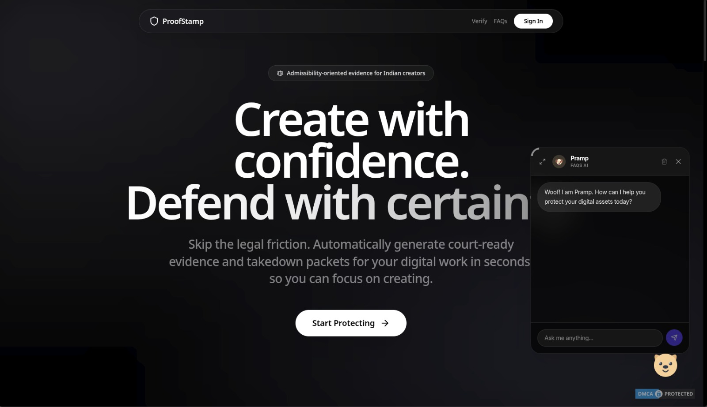
</div>
---

Invisible digital stamps for protecting creative work. Upload a file (images, documents, audio, video, etc.), register a cryptographic hash and RSA identity signature, optionally embed resilient image watermarks for photos, and verify authenticity later through multiple layers.

**Why ProofStamp?** (vs. Blockchain/NFT/Email-yourself)
> **Blockchain/NFTs** are public, expensive, and require crypto wallets; **emailing yourself** is legally flimsy and easily spoofed. ProofStamp offers **cryptographically secure, legally compliant (BSA 2023 Sec 63), privacy-first digital forensics**—without gas fees or making your private work public.

---

##  Table of Contents
- [Architecture & Directory Structure](#architecture--directory-structure)
- [Quick Start](#quick-start)
- [Documentation](#documentation)
- [Processes & Features](#processes--features)
- [Contributing](#contributing)
- [License](#license)

---

##  Architecture & Directory Structure

<div align="center">
  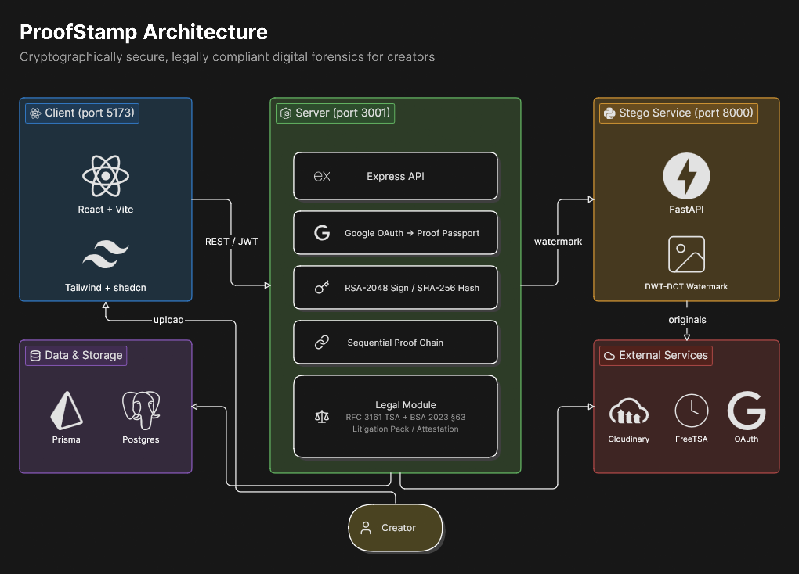
</div>

ProofStamp is a monorepo consisting of three main microservices:

```text
proofstamp/
├── client/           → React + Vite + Tailwind + shadcn/ui (port 5173)
├── server/           → Node.js + Express + Prisma (port 3001)
├── stego-service/    → Python + FastAPI + Pillow (DWT‑DCT watermark) (port 8000)
├── prisma/           → Database schema & migrations
├── docs/             → Detailed guides, compliance, and API docs
│   └── research/     → Foundational research and legal text references
├── scripts/          → Testing and utility scripts
├── .github/          → Open source issue & PR templates
└── docker-compose.yml
```

---

##  Quick Start

The fastest way to run all 3 services locally is using **Docker Compose**:
```bash
docker compose up --build
```
For detailed local setup instructions and manual environment configuration, please refer to the [Local Setup Guide](docs/local-setup.md).

---

##  Documentation

Dive deeper into ProofStamp's capabilities and compliance:

-  **[Local Setup Guide](docs/local-setup.md)**
-  **[Technical Architecture](docs/TECHNICAL_ARCHITECTURE.md)**
-  **[Indian Legal Compliance (BSA 2023)](docs/INDIAN_LEGAL_COMPLIANCE.md)**
-  **[AI Protection Guide](docs/AI_PROTECTION_GUIDE.md)**
-  **[Verification & Legal Guide](docs/VERIFICATION_AND_LEGAL_GUIDE.md)**

---

##  Processes & Features

- **Identity:** Google OAuth → Proof Passport (`PP-YYYY-XXXXX`) with RSA‑2048 keypair.
<div align="center">
  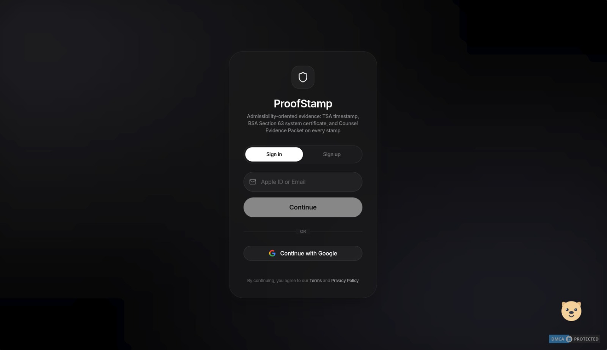
  ➜
  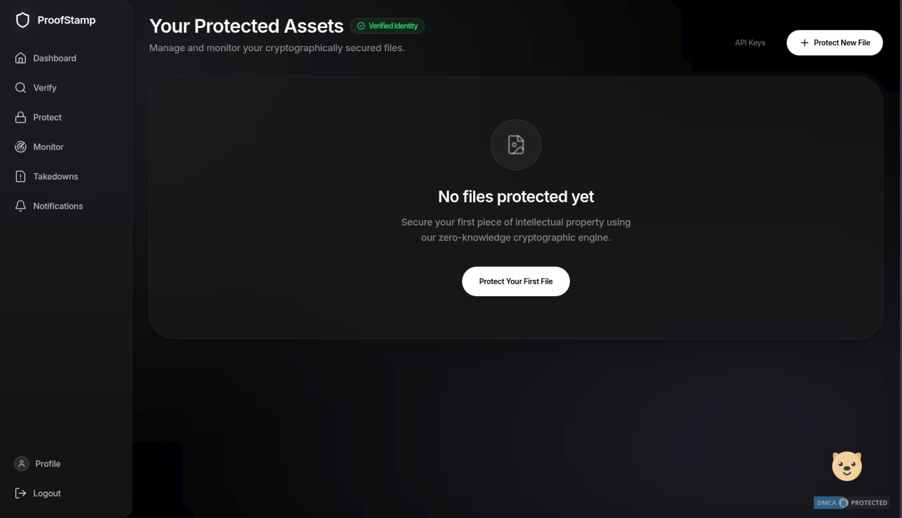
  ➜
  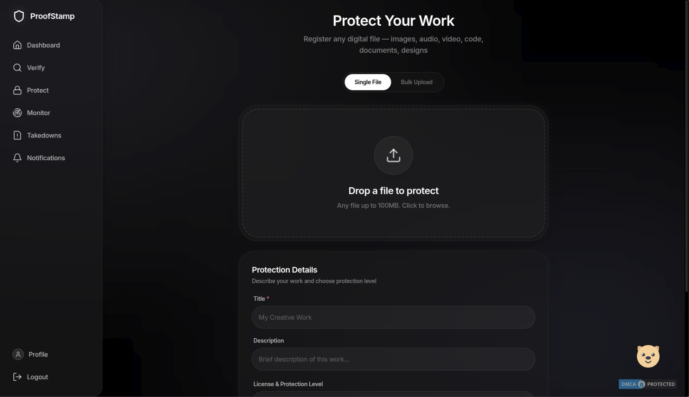
</div>
- **Stamp:** File upload → SHA‑256 fingerprint → RSA signature tied to Passport → sequential proof chain linking block hashes. For raster images only: perceptual hashing (pHash/dHash), optional embeddings, **DWT‑DCT invisible watermark**, Cloudinary originals, Certificate PDF generated in background.
<div align="center">
  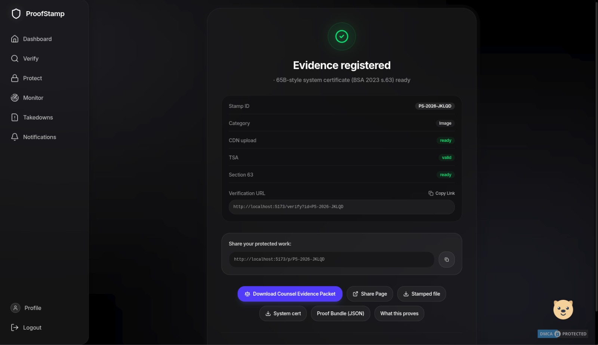
  ➜
  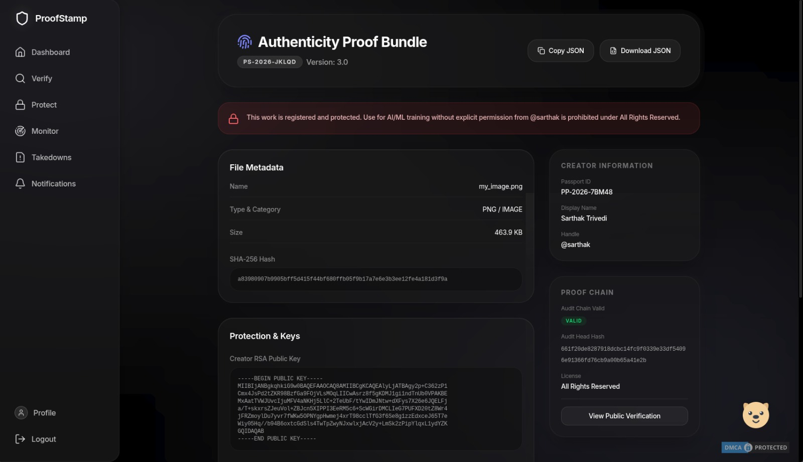
  ➜
  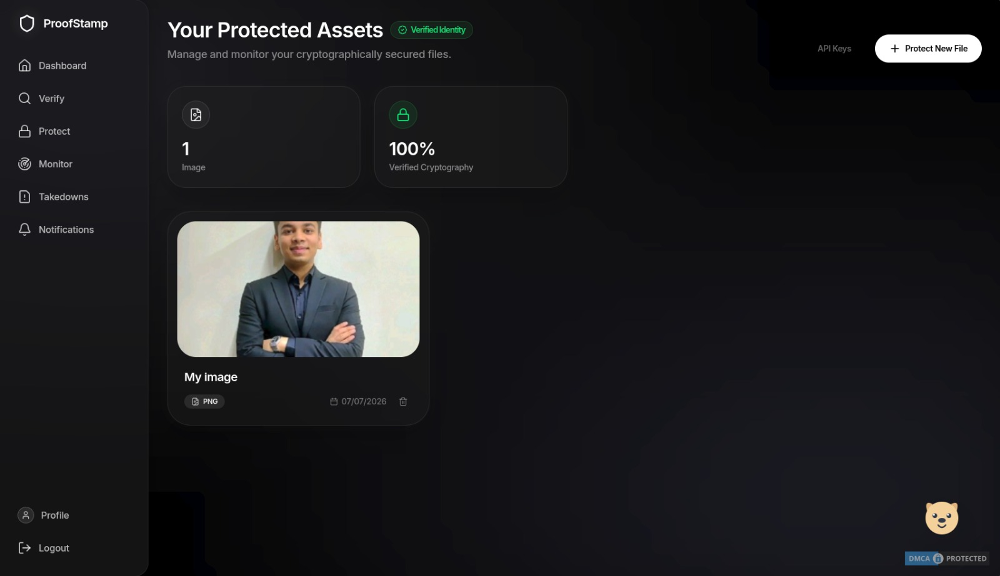
</div>
- **Verification:** Upload or Stamp ID lookup → Exact hash → Perceptual / embedding similarity → watermark extract → cryptographic signature & chain checks where applicable.
<div align="center">
  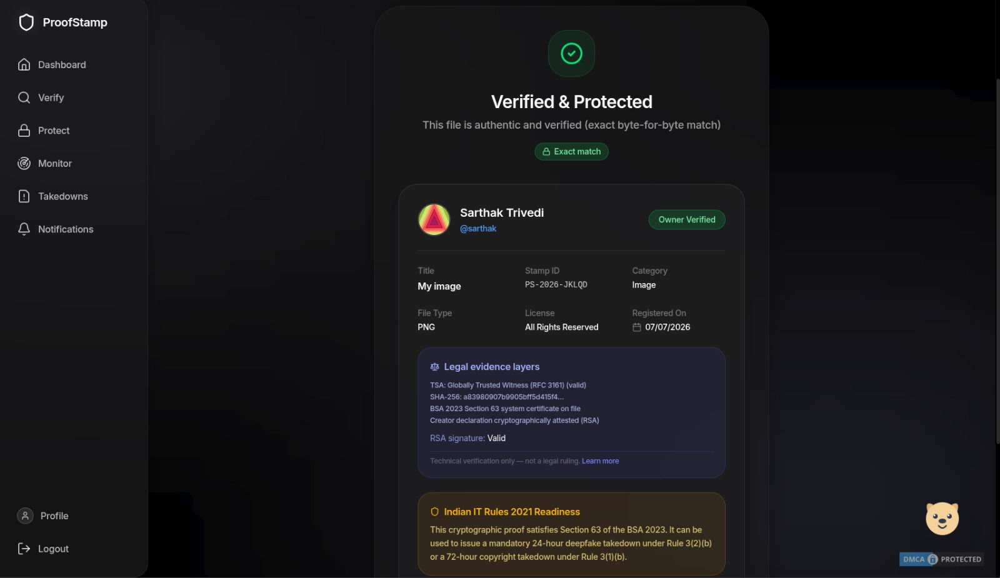
</div>
- **Enforcement:** Similarity detection → infringement evidence compilation → auto-generated takedown package (DMCA notice, certificates, proof chain, and supporting artifacts) → creator review and submission.
<div align="center">
  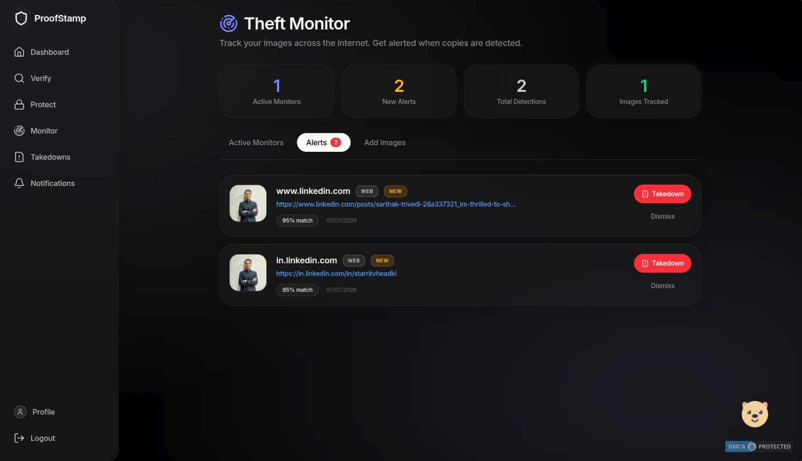
  ➜
  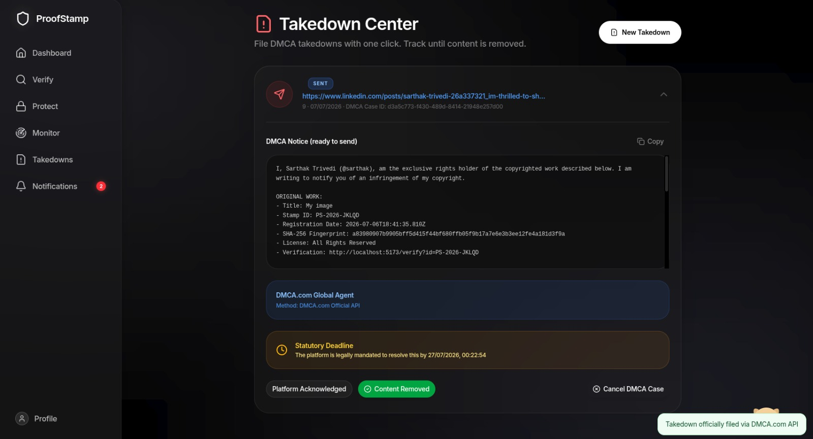
</div>


### Legal Proof (Enabled for all users)
Every stamp includes:
- **RFC 3161** timestamp (FreeTSA by default; set `TSA_URL` / `TSA_CA_CERT_PATH`)
- **BSA 2023 Section 63** system certificate PDF (India electronic evidence helper)
- **Counsel Evidence Packet** — `GET /legal/:stampId/litigation-pack` 
- **Creator attestation** — `POST /legal/:stampId/attest`

---

##  Contributing

We love our contributors! Whether you're fixing bugs, adding new features, or improving documentation, your help is welcome. 

Please read our [Contributing Guide](CONTRIBUTING.md) to get started with setting up your dev environment and submitting a Pull Request.

---

##  License

This project is licensed under the MIT License - see the [LICENSE](LICENSE) file for details.
